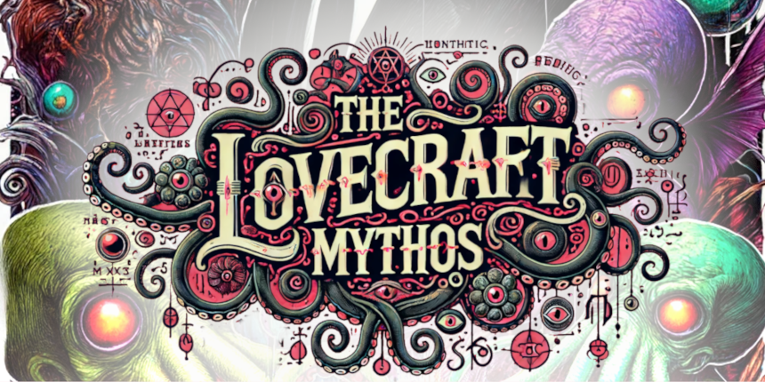

# Lovecraft Public Domain

> Public Domain short stories by HP Lovecraft in Markua format.

This repository contains the original stories which Lovecraft wrote as an adult. 
It begins in 1917 with “The Tomb” and ends in 1935 with his last original work “The Haunter of the Dark.” 
The book is ordered chronologically by the date the story was written. Because Lovecraft was a terrible businessman 
and left no heirs to his intellectual property, all of his works are already in the public domain.

## Read the Book

You can read the book online at [LeanPub.com](https://leanpub.com/lovecraft-mythos).
It is available for free, but you can choose to pay for it if you want to support the project.
You can download the book in various formats (PDF, EPUB, HTML) from the same link.

If you want to compile the book yourself, you can clone this repository and run the `ops/run_full.sh` script.
Though you will need to have `docker` (or `podman`) installed on your system.
Note that the lay-outing, styling, and formatting of the book are done using the Leanpub platform, and the alternative compilation may not look as
good or miss some parts of the content.

## Contents

* **manuscript:** Contains the stories in Markua format.
  * **Book.md:** The main file that includes all the stories to be included in the book.
* **raw_converts:** Contains the stories in raw text format, as extracted from various sources.
* **ops:** Contains a bunch of scripts to assist with the conversion process.

## How to Contribute

Proofreading, fixing typos, and improving the formatting are all welcome.
To contribute, please fork the repository, make your changes, and submit a pull request.

**If you want to include a new story, please make sure it is in the public domain.**

## Technical Flow

For those interested in the approach taken to convert the stories from public websites to a published book, here is a brief overview:

1. Extract the raw text from the public domain websites using simple scripting, and removing any HTML-tags.  
  (a bunch of shell scripts, being creative with `wget`, `cat`, `head`, `tail`, `sed`,`awk`, etc.)
2. Convert the raw text to Markua format.
   * This is mostly done manually, after the extraction.
3. Categorize the stories into different files based on themes.
   * Define categories and subcategories.
   * AI-assisted categorization using OpenAI's GPT-4.
4. Compile the book using Leanpub's platform (pulled automatically from this very repository).

The process is not fully automated, and there is a lot of manual work involved in cleaning up the text, formatting it, and categorizing the stories.
This is because the quality of the text extracted from the public domain websites is not always perfect, and the stories are often split into
multiple parts. Furthermore, the stories are not always in the correct order, and the metadata is often missing.
Lovecraft had a habit of being expressive with his language, and the stories are often filled with archaic words, complex sentences, and
creative formatting. These are extremely difficult to parse and convert to a structured format automatically.

## Changes

* **version 1:** Initial release with most of Lovecraft's public domain stories, structured in a single book.
* **current WIP:** Expanding the book to include more stories and improve the structure (ordering stories by theme).